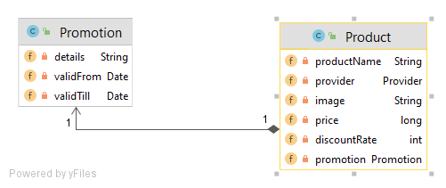

# REQUIREMENT
A startup company name "Smart Choice" wants to build a website that can compare the
price of a product from different resources (Tiki, Lazada, Shopee...). In order to get to the
market quickly, they want to build an MVP version with a limited set of features:

1. A Rest API to support their customer compare a product price, the API should
return the product name, current price, the discount rate, promotion...
2. The customer can click on the product to see more details or view the product's
images
3. For audit support, the company wants to keep track of the searching history of
the customer. Failure to store customer activity should have no impact on the
function or performance of the Rest APIs
4. In long term, the website could be used by a lot of people, the company need
to improve the performance of the system and they need to resolve the issues:
5. Getting the product information from many different resources (Tiki, Lazada,
Shopee...) take a lot of time in high traffic period. All the data must be
completely returned from 3rd parties before the API can return to the website.
6. Each request sent to 3rd will be charged for a fee, the company want to
decrease the cost and improve the effectiveness of the application.

# High level Design

In order to satisfy the requirement, we need to build Microservice system that will be decribed in the following picture : 

- **product-adapter-service** : service to call external 3rd party providers' api (Tiki, Lazada, Shopee...) to fetch/search products from them. The **product-adapter-service** is the only service that has the right to access to provider's api, no direct called will be made to 3rd without going through adapter service.
- **product-service** : the main service that the UI/Customer communicates directly to. This service will call **product-adapter-service** to search a particular product information from 3rd provider.
- **audit-service** : the service used for keep tracking the search history of user
- **api-gateway** : Route along services via a single point. It helps to access to internal services without knowing their host and port. Request will be redirected to exact service need to be serve by situations.
- **registry-service** : Service's registration and discovery in our system. It helps API Gateway routing requests by service name instead of hard-code URL
- **authentication-server** : An Auth server to support OAuth sercurity as well as provide the security protection for service call.

# Microservice Design

## Product Apdater Service

Access to 3rd parties' api/library, this service role plays as adapter that call 3rd parties, other services do not allowed to use or call directly to 3rd api. The benefit it will standardlize the result that we get from 3rd to actual information we want to achieve and return them in the same structure as we define in product-adapter-service. In the future if we want to add more provider or their apis are changes, we just need to update product-adapter-service, other services do not need to care, that means we narrow the risk and maintainance cost.
### Service Design 

Each call to 3rd will be charged, we need to reduced making call to 3rd api as much as possible. Since all the data must be completely returned from 3rd parties before the API can return to the website, we can asynchronously call to those apis and temporary cache the result base on **product name and provider name** to reduce to call to 3rd in short time, if one of those providers is unreachable or down, we just need to retry to call on that service, the result from other providers that we succesfully called before will be get from cache, instead of remake the full call of all providers. So what we need are :

- Short-tearm storage
- Fast read time
- List of product stored base on product namd and its provider

A HashMap database structure as **REDIS** seems to meet our requirement.

In high traffic situation, there may be thousands calls  from **product-service** to **product-adapter-service** to search different products. In order to handle huge traffic we can use the **Kafka** , the **product-adapter-service** will be a producer that whenever it successfully get information of a product from 3rd parties, it will send that information to message queue. The **product-service** as a consumer will receive the information from queue and update to cache system(Redis), when we have high traffic, we can scale up to multiple instances that in the same message group, so that if at least one instance is able to get the information from queue and update to cache, then other instances do not need to call **product-adapter-service**, a lost of money will be saved. It also ensures that if the **product-service** is down, the information of product will not be lost since it is kept in the queue.

### Database design
Product will contains the product name, current price, the discount rate, promotion. Image is base64 encoded content that can be directly use on the UI to show product image.

## Product Service

Product service receive search request to return the product information from 3rd providers in order to compare the price between them. Product service is the main service that communicate with customer request.

### Service Design

When product-service recieve a request to get information for a product , it will call product-adapter-service to get those information from providers. Each information for a product will be grouped by productName call ProductGroup. In order to make the system performance and saving the cost, each time we have a ProductGroup information, we will cache it to Redis (note that it will be a redis separated databa from product-adapter-service, redis support us to have multiple databse in the same Redis server). This cache can have longer lifespan, since product information of a product does not change too frequently, cache lifespan is surely configurable.

Product service as a consumer also listens on Kafka queue, whenever it recieve a product information, it will update Redis cache. In scalable perspective, when a lot of requests are made to multiple product-service instance to search to same productName, if at least one instance have recieved that product information from product-adapter-service and cached it, then other intances just get from cache instead of make a call to product-adapter-service. This approach can reduce calls to product-adapter-service, fast reaction. If one instance of product service is dead, when a new instance created, it also can get information from message queue or cache. The interaction between product-service and product-adapter-service is decribe in the following picture

### Database design
Each product will be grouped in a ProductGroup that contains information from all 3rd providers

## Audit service
The service used for keep tracking the search history of user, whenever user makes a search product call, this information will be tracked.

### Service design
Whenever a search request has been made to product-service, we use spring AOP and define the PointCut and give it and Advice to record the search. 

Due to the failure to store customer activity should have no impact on the function or performance of the Rest APIs, therefore we use Kafka as message queue with product-service as a Producer(Source) and audit-service as a Consumer(Sink). Then if the audit-service service is dead or unreachable, there is no impact to product-service, and the message will be safe in queue, the data will not be lost

### Database design
We need to keep track which productName that user search, timestamp, performed by which user.
What we need from a database is 
- Long-term storage.
- Handle large data, in short time (up to the traffic to product-service)
- None-relational database
- Flexible data structure
  
Then mongoDb is a good fit.

## Api Gateway

In production environments, the host and port of a service are frequently change due to the scalability of the system, a lot of instance of services will be destroyed or created due to the traffic and system need, handle the endpoint of service is really a challange. Api gateway is solution that external request just need to communicate to service systems via a single point, api gateway will decide which service will be called base on which request, load balancing is also supported to redict to instances of services. Api gateway also helps for processing common request needs as : propagting jwt token, propagating header , ssl certificate,...

### Service Design
We use spring-cloud-netflix-client to route external request to correct service
We use spring-boot-starter-oauth2-resource-server as resource server and secure the request.
When use make a call to services, we also add username as the header to separated request alongs users and for keep tracking in audit-service, then we use ZuulFilter.

## Registry Service
We need to support api gateway to discover services endpoint, api gateway just need to access to service via its registration name.

### Service Design
We use spring-cloud-starter-netflix-eureka-server to let services register itself to Eureka server, and help api gateway access to them without knowing the real URL.

## Authentication Server
An Auth server to support OAuth sercurity as well as provide the security protection for service call.
### Design
User will be authenticated by auth server, after that a jwt token will be generated, API gateway will authenticate it with spring-boot-starter-security, username will be extracted and progated through services by ZuulFilter.

I choose Keycloak for this assignment, which is a strong Auth Server, easy to configure, flexible, API support ,... Other replacements can be Okta, Google OAuth2,...

# Whole system design

# How to install

## Prerequisite
- Install Java 11
- Docker 
- A linux execution command line(since my installation script is written in linux).
- Set dock desktop Ram resources at least 4GB (it iss would be great to be 8GB )

## Install
### Run Enviroment setup
At root of project run install.sh to install all the thing
### Service port
| Service                 | Port |
| ----------------------- | ---- |
| api-gateway             | 9080 |
| product-service         | 9081 |
| product-adapter-service | 9082 |
| audit-service           | 9083 |
| registry-service        | 8761 |
| keycloak                | 7777 |
| mongo                   | 27017|
| redis                   | 6379 |
| kafka                   | 9092 |

### Testing command
Use command in test-command.md to test the system

You can also import postman collection and test via postman postman-collection.json

# Applied Principles

# Design Pattern

# Library

# Improve to be perfect
This section is my idea that can improve the current system design, since time is limited, I cannot archive all of them, these points should be considered to implemented in real system.

## Logging system
Loggin roles a important part in microservices design, ELK stack can be applied to make logs centralized, easy to track, anylized and report. In the flow of service calling, when a service call a service, we can append to service id or service uid and send as a header to next service, then if an error occurs, we can know exactly which service is broken.

## Configuration System
Currently, configurations take place in spring application.propertise, it is not reactive and flexible in runtime, suppose that we want the pre-config a confuguration that will be apply in a specific of date (e.g : X-mas discount, 11-11 sale,...) then current design is not fit. A configuration service or a configuration system (eg. Spring configuration server) should be implemented.

## Registry service and loadbalancing replacement

We can use Kubernetes to replace registry service to discover mircroservices, then bottle neck at registry service will be solved. Kubernetes is perfect choice to manage container, deployments or CI/CD integrations.

## Authentication adapter service
We need to make the set up of authentication server automatic and flexible, and well support for CI/CD pipline. An adapter service to use authencation service API to support configuring security is also a need in microservices system.

